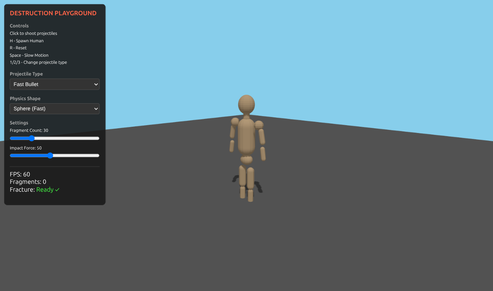

# Procedural Human Destruction System

An interactive playground for procedural destruction of human models using Voronoi fracture and physics simulation.



## Features

- **Voronoi Fracture** - Breaks meshes into realistic fragments
- **Body-Part Specific Destruction** - Click individual parts (arm, leg, head, torso) to destroy only that part
- **Physics Simulation** - Fragments fly apart with gravity and collisions
- **Procedural Human Mesh** - Generated from primitives (capsules, spheres)
- **Minimalist Visual Style** - Clean, game-like aesthetics

## Tech Stack

- **Three.js** - 3D rendering
- **Cannon.js** - Physics simulation
- **Vite + TypeScript** - Build tooling

## Quick Start

```bash
npm install
npm run dev
```

Open http://localhost:5174

## Controls

| Key | Action |
|-----|--------|
| Click | Fire projectile at body part |
| Space | Toggle physics debug rendering |
| R | Reset human |
| H | Toggle helper UI |
| 1-3 | Switch projectile types |

## Architecture

```
src/
├── core/           # Scene, physics world, rendering
├── geometry/       # HumanBuilder, VoronoiFracture
├── physics/        # Fragment bodies, collision handling
├── entities/       # Human, Fragment, Projectile
├── systems/        # DestructionManager, Object pooling
├── effects/        # Particles, visual effects
└── interaction/    # Input, camera, launcher
```

## How It Works

1. **CompositeHuman** creates 16 separate body part meshes
2. Each part is **pre-fractured** on spawn (Voronoi cells computed in background)
3. **Raycaster** detects which body part was clicked
4. **DestructionManager** swaps the mesh with pre-computed fragments
5. **Physics** takes over - fragments fall, bounce, and settle

## License

MIT
